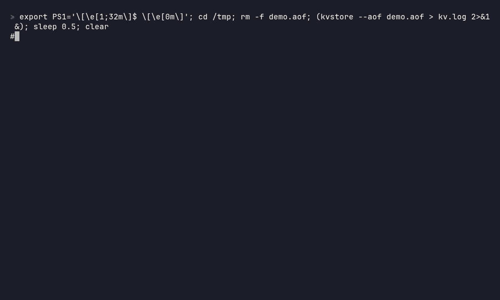

# ✷ kvstore

A Redis-compatible in-memory key-value store in **C++17**, built on a single-threaded
**epoll** event loop. It speaks RESP2, so the official `redis-cli` and `redis-benchmark`
work against it unchanged.



## Build and run (Linux / WSL)

`epoll`, `signalfd` and `fork()` are Linux APIs, so build on Linux or inside WSL on Windows.

```bash
sudo apt install g++ cmake redis-tools
cmake -S . -B build && cmake --build build -j
./build/kvstore --port 6390 --aof appendonly.aof        # in one terminal
redis-cli -p 6390 SET hello world EX 100                 # in another
redis-cli -p 6390 GET hello
```

## Benchmark against real Redis

`redis-benchmark -t set,get -n 200000 -c 50 [-P 16]`, both servers on the same laptop.
kvstore runs with its AOF on (`everysec`); Redis runs with persistence off.

| ops/sec | kvstore | Redis 7 |
| --- | --- | --- |
| SET | 101K | 101K |
| GET | 97K | 101K |
| SET, pipeline 16 | 1.03M | 0.93M |
| GET, pipeline 16 | 1.23M | 1.04M |

Without pipelining both are bound by syscalls and the network, not by the server.
(kvstore does far less than Redis per command, so treat this as "same ballpark", not "faster".)

## Supported commands (MVP)

`PING` `ECHO` `GET` `SET key val [EX s|PX ms|EXAT s|PXAT ms] [NX|XX] [GET]` `DEL` `EXISTS` `KEYS pattern`
`DBSIZE` `FLUSHALL` `EXPIRE` `PEXPIRE` `EXPIREAT` `PEXPIREAT` `PERSIST` `TTL` `PTTL` `BGREWRITEAOF` `SELECT 0` `INFO` `QUIT`,
plus `COMMAND` / `CONFIG GET` / `CLIENT` stubs so the official tools start cleanly.

## How it works

| File | What it does |
| --- | --- |
| `src/event_loop.cpp` | `epoll_wait` loop; edge-triggered client fds drained until `EAGAIN`; partial writes park on `EPOLLOUT`; SIGINT/SIGTERM blocked and read from a `signalfd` in the same loop for a clean shutdown |
| `src/resp.cpp` | incremental RESP parser (returns `NeedMore` on partial frames → handles pipelining and split TCP reads), inline commands, size limits |
| `src/commands.cpp` | command table with Redis arity rules and Redis-identical error strings |
| `src/store.cpp` | keyspace + lazy expiry + Redis glob matching |
| `src/aof.cpp` | append-only file: writes logged in RESP, `fdatasync` per policy, replayed on startup; a torn last command is cut off with `ftruncate`; `BGREWRITEAOF` compacts it in a `fork()`ed child |

## Persistence (AOF)

Every write is appended to the `--aof` file in RESP, the same format
clients send. Relative TTLs are logged as absolute times (`SET k v EX 10` → `SET k v PXAT <unix-ms>`),
so a restart does not reset the countdown. On startup the file is replayed.

```
kvstore --aof appendonly.aof --appendfsync always|everysec|no   # default: everysec
```

| `--appendfsync` | When `fdatasync()` runs | Can lose on power loss | SET/s (50 clients) |
| --- | --- | --- | --- |
| `no` | never; kernel flushes the page cache itself | ~30 s | ~102K |
| `everysec` | at most once per second, from the event loop | ~1 s | ~100K |
| `always` | before every reply | nothing | ~0.8K |

Crash test: 100K `SET`s, then `kill -9` the server, then restart →
`aof: replayed 100001 commands in 73 ms, 63287 keys`, with TTLs intact.

### Compaction with `fork()`: `BGREWRITEAOF`

The log only grows (`SET counter 1` … `SET counter 1000000` is a million entries for one key).
`BGREWRITEAOF` shrinks it to one `SET` per live key without pausing the server:

1. `fork()`. The child shares the parent's memory **copy-on-write**, so it sees a frozen
   snapshot of the keyspace; the kernel copies a page only when the parent modifies it.
2. The child writes the snapshot to `appendonly.aof.rewrite.tmp`, `fsync`s it and `_exit`s.
3. The parent keeps serving. New writes go to the old AOF *and* to an in-memory rewrite buffer.
4. Child exits → kernel sends `SIGCHLD` → it arrives on the same `signalfd` → `waitpid()`,
   append the rewrite buffer to the temp file, then `rename()` it over the AOF (atomic).

Measured with 1M `SET`s over ~200K keys, while another client kept writing at 87K SET/s:

```
aof rewrite: child pid 14 started (fork took 900 us)
aof rewrite: done in 118 ms, 112554049 -> 21786484 bytes (+495731 bytes written meanwhile)
```

Then `kill -9` + restart: all 199,695 keys back, including one written during the rewrite.
